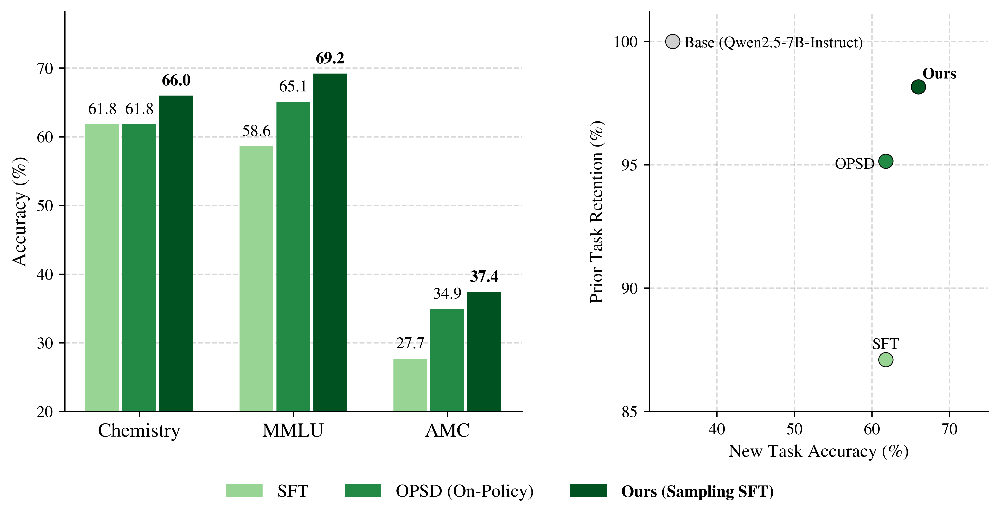

# Finetuning with Sampling


### [Paper](https://arxiv.org/abs/2610.02140) | [Project Page](https://aakaran.github.io/finetuning_with_sampling/)

[](chem_teaser.png)


This repo contains the official PyTorch implementation of Finetuning with Sampling.
> [**Finetuning with Sampling: SFT Learns Better Than You Think**](https://arxiv.org/abs/2610.02140)<br>
> [Aayush Karan](https://aakaran.github.io/), [Sitan Chen](https://sitanchen.com/), [Yilun Du](https://yilundu.github.io/)
> <br>Harvard<br>


## Setup

Run the following script to setup environment.

```bash
git clone https://github.com/aakaran/finetuning-with-sampling.git
cd finetuning-with-sampling
conda env create -f environment.yml
conda activate mcmc
```


## Sampling

The main directory contains slurm scripts to run projection sampling for chemistry (```boost_sci.py```), whose training data .json is included in sci_data, as well as math (```boost_math.py```), whose training data .parquet is in math_data. 

To run projection sampling on chemistry with 15 shard parallelism:
```bash
sbatch boost_sci.sh
```
The output is several .jsonl files (based on the shard number) that store the boosted traces, original solution, correctness, etc. Accompanying files are trace_boosted .jsonl files, which track which MCMC candidates actually get accepted throughout the entire MCMC process. These can be used to obtain teacher distillation logits for the full boosted traces if needed. For standard SFT, the trace_boosted .jsonl files are not needed, so the logic can be disabled since the trace_boosted file outputs are memory intensive.


## Training

For SFT training, we refer to the setup in https://github.com/yongliang-wu/DFT. For chemistry and math, use ```bash --learning_rate 5e-5``` and ```bash --num_train_epochs 2```. A sample SFT launch script is provided for reference (in ```bash utils/fsdp_utils.py``` in the DFT codebase, may need to modify the file to convert ```bash fsdp_transformer_layer_cls_to_wrap``` to a list when the instance is a set for indexing).


## Evaluation

To evaluate trained checkpoints, 


